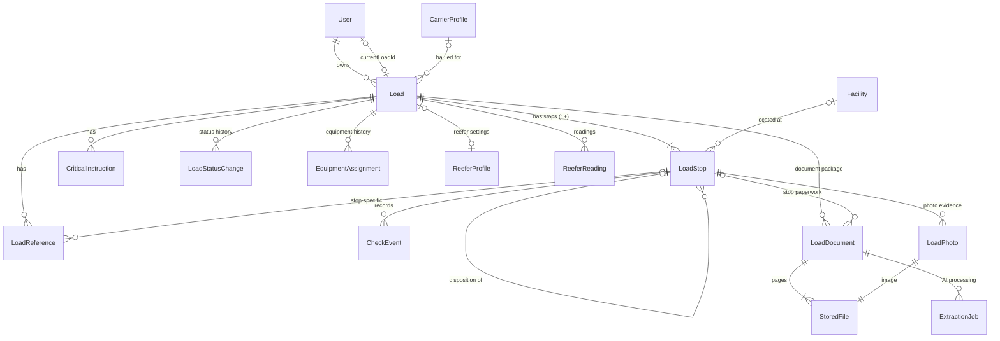
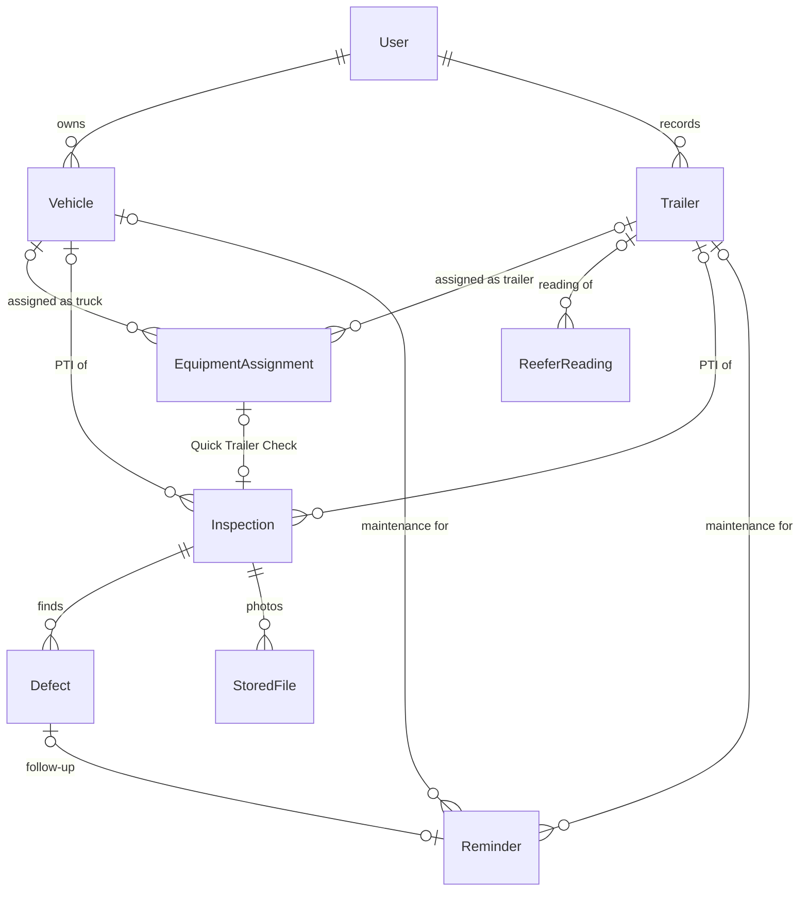
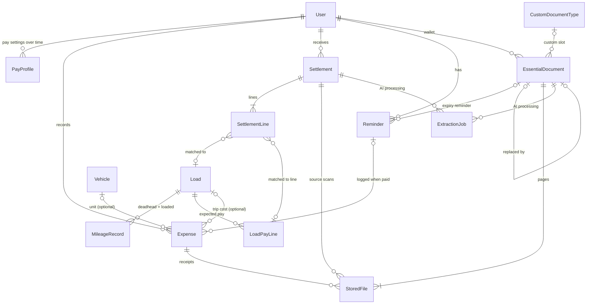
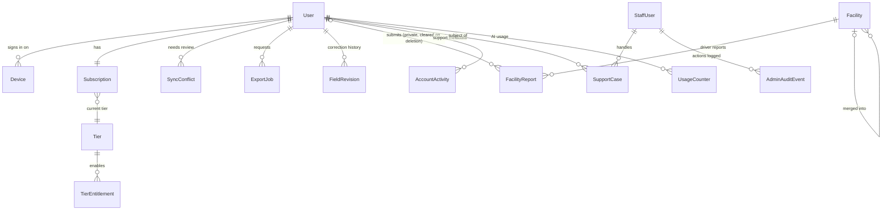

# CabPilot (TruckMate) — V1 Data Model

**Status:** DRAFT v0.3.1 — review findings merged; awaiting owner approval. **Not approved.** Not yet project truth.
**Drafted by:** Claude, 2026-10-01. **v0.2:** 2026-10-02, merges the GPT and Gemini reviews (`reviews/`) and owner decisions TM-D079–TM-D082. See §8 for what changed.
**Expands:** Master SRS §25 ("conceptual, not a final database schema").
**Baseline:** frozen V1 requirements through TM-D084. This document adds **no product behavior**. Every entity and field must trace to an SRS section or decision. Anything that would need a new product decision is listed in §6 (Open questions) instead of being modeled silently.

## How to read and edit this document

- **§4 Data dictionary is the source of truth.** The diagrams in §3 are derived from it and show only entities and relationships, not fields. If a diagram and the dictionary disagree, the dictionary wins.
- **Any change to an entity or relationship must update the dictionary and the matching diagram in the same commit.**
- This is a **logical** model. It does not choose Firestore collection paths, indexes, or denormalization. Those are implementation decisions (§7).
- Reviewers use `REVIEW_TEMPLATE.md` and save their review as `reviews/<ai-name>.md`. Reviewers do not edit this file directly; the owner/drafting AI merges accepted findings.

---

## 1. Design goals

1. **Collect once, reuse everywhere** (TM-D004). One fact lives in one place; screens, share messages, exports and reports read it from there.
2. **Private by default** (TM-D007, TM-D053). Driver data is owned by one user; shared/reference data (facilities) never exposes who contributed it.
3. **Offline-first and duplicate-safe** (TM-D024, TM-D025, TM-D047). Records created on the phone must be safe to re-send (idempotent) and preserve how each value was obtained.
4. **Corrections never erase the original** (TM-D019, TM-D029, TM-D030).
5. **Extension without speculation** — team/shared loads (TM-D022), more trailer types (TM-D040) and more tiers (§39) must be addable later without rewrites, but are not built now.

## 2. Cross-cutting rules

These rules apply to every entity unless the entity says otherwise. They are the decisions that are most expensive to change later, so reviewers should challenge them first.

### R1 — Standard fields
Every user-data record carries:

| Field | Type | Notes |
|---|---|---|
| `id` | UUID | **Generated on the device** at creation, not by the server. The server **must treat this ID as the idempotency key**: a create that arrives again with an existing ID is merged/ignored, never stored as a second record. That makes offline creation and retries safe (effectively-once, TM-D025). |
| `ownerUserId` | ref User | The user who owns the record. Authorization checks this (§19). |
| `createdAt` / `updatedAt` | instant (UTC) | Server-assigned when the server accepts the record. **Empty while the record exists only on the device** (e.g. created offline); never fabricated by the client. |
| `clientCreatedAt` | instant | Device clock at creation. Kept separately because device clocks can be wrong (TM-D047). |
| `createdOnDeviceId` | ref Device | Which phone created it. Supports sync debugging and conflict recovery. |
| `version` | int | Incremented by the server on each accepted change; used to detect concurrent edits. Empty until first accepted. |

**Exception — shared community data.** `Facility` and `FacilityReport` are shared/reference records, not user-owned data. They do **not** carry `ownerUserId` (or `createdOnDeviceId`). A FacilityReport's only link to a person is `reporterUserId`, which is cleared on account deletion, leaving the report fully anonymous (TM-D081).

### R2 — Ownership now, sharing later (TM-D022)
- V1: every user-data record has exactly one `ownerUserId`; authorization is "owner only".
- Later: team/shared loads add a separate `LoadMember (loadId, userId, role)` record. Access checks become "owner **or** member". No existing record changes shape.
- To keep this possible, **per-driver state never lives on the shared Load record** — for example, "which load is my Current Load" lives on `User.currentLoadId`, not on `Load`, because two team drivers sharing a load would each have their own Current Load.
- Physical layout must therefore not nest loads *inside* a user's private path in a way that makes sharing impossible (§7).

### R3 — Provenance and corrections (TM-D019, TM-D029, TM-D030, §30)
- Each entity stores the **current, operational value** directly in its field.
- Any field whose value came from AI extraction, route estimation or automatic capture records its **source**: `AI_EXTRACTED`, `SYSTEM_CAPTURED`, `ROUTE_ESTIMATED`, `CARRIER_STATED`, `MANUAL`.
- When a user corrects such a value, the original and the correction are written to `FieldRevision` (§4.D). The entity keeps only the current value; history lives in `FieldRevision`.
- Priority on sync (TM-D047): a deliberate `MANUAL` value outranks `AI_EXTRACTED`/`SYSTEM_CAPTURED`/`ROUTE_ESTIMATED`. Two conflicting `MANUAL` values are **not** resolved by device timestamp; both are kept in a `SyncConflict` (§4.H).

### R4 — Time
- Moments that happened are stored as a **UTC instant plus `eventTimeZone`** (the IANA time zone where it happened), so history always displays in the local time it happened. **Every event record carries `eventTimeZone`:** CheckEvent, LoadPhoto, Inspection, ReeferReading, LoadStatusChange.
- **Appointments are local wall-clock times at the facility**, not instants. Each stop stores its own `timeZoneSnapshot`, so the appointment stays correct even when no Facility record is linked. A driver crossing time zones must still see "Appt 8:00 AM" as the facility means it.
- Calendar-only values (document expiry, reminder due date, settlement period) are plain `date`.

### R5 — Location
- Location is optional everywhere. Stored as `GeoPoint {lat, lng, accuracyMeters, capturedAt}` plus `locationStatus`: `CAPTURED`, `PERMISSION_DENIED`, `UNAVAILABLE`.
- Precise location is private driver data. Support/admin may see **coarse city only** (§37, TM-D053). Facility reports never expose the reporter's location history (§16).

### R6 — Money and units
- Money is stored as integer **minor units (cents)** plus a currency code (`USD` default). Never floating point.
- **Exception — unit prices.** Fuel is priced in tenths of a cent ($3.899). The paid total and the quantity are the source of truth; a printed unit price, when kept, is stored in **mills** (thousandths of a dollar).
- Distance in miles (decimal). Temperature as value + unit (`F`/`C`); the user's display unit is a setting.

### R7 — Deletion
- **Documents and files** (load documents, essentials, photos, receipts): user delete sets `trashedAt`; restorable for 30 days; then the file is **permanently deleted** and the record becomes a tombstone that keeps only "a document of category X was deleted on date Y" (TM-D031, §19).
- **Loads** (TM-D082): delete sets `trashedAt` on the load; the load and everything under it (stops, check events, documents, photos, references, instructions, equipment history, readings, pay lines, mileage) are hidden together and restorable as a whole for 30 days, then permanently deleted.
- **Small records** such as expenses and reminders (TM-D082): deleted immediately, with Undo in the app. The server keeps a short-lived **tombstone** (ID + `deletedAt`) so other devices learn about the deletion when they sync. Attached files still follow the Trash rule above.
- **Settlements** (TM-D083): delete sets `trashedAt`; the settlement, its lines, scanned pages and load matches are hidden together and restorable as a whole for 30 days, then permanently deleted. While trashed, its matches do not count toward load settlement status.
- **Account deletion** (TM-D081): sets `User.status = DELETION_PENDING`, revokes every Device, then a server job permanently deletes all records and files owned by the user. FacilityReport rows are kept with `reporterUserId` cleared. Export is offered before, never required. Billing records live with the billing provider, not in driver data.

### R8 — Hidden is not deleted (TM-D075, §39)
- Tier access is decided **when data is read**, from the user's current entitlements. No flag is written onto data at downgrade.
- O/O-only data (settlements, revenue, financial analytics) therefore stays untouched on downgrade and reappears on re-upgrade with no migration.

### R9 — Extensible enums
Enums that the SRS says may grow (trailer type, document slot, expense category, stop kind, reference kind, critical-instruction kind) are stored as **string codes**, not ordinal integers, and clients must tolerate unknown codes by showing them as "Other". This lets later versions add values without breaking older app versions still in use offline.

### R10 — Derived values are not the source of truth
Values that can be computed from other records (dwell time, paperwork completeness, Current/Next/History grouping, report totals) are marked **derived**. They may be cached for speed, but the cache is always rebuildable and never edited directly.

---

## 3. Relationship diagrams

Four diagrams, one per domain. Entities only; fields are in §4. `||--o{` = one-to-many, `|o--o{` = optional one-to-many, `||--o|` = one-to-zero-or-one.

### 3.1 Load core

### 3.2 Equipment and inspections

### 3.3 Money, miles and reminders

### 3.4 Account, sync and operations

---

## 4. Data dictionary

Column meanings: **Req** = required (Y), optional (—), or derived (D). **Source** = SRS section or decision that requires the field. Standard fields from R1 are not repeated.

### 4.A Account and access

#### User
The driver account. Authentication itself is Firebase Authentication; this record holds the product-level account.

| Field | Type | Req | Notes | Source |
|---|---|---|---|---|
| `authUid` | text | Y | Firebase Authentication user ID. | §21 |
| `phoneE164` | text | Y | Primary login. Unique across active accounts. | §37, TM-D051 |
| `email` | text | — | Optional backup channel. | §37 |
| `emailVerified` | bool | Y | Only a verified email can confirm a phone change. | TM-D062 |
| `displayName` | text | — | | |
| `status` | enum | Y | `ACTIVE`, `SUSPENDED`, `RECOVERY_HOLD`, `DELETION_PENDING`. | §38, TM-D081 |
| `deletionRequestedAt` | instant | — | Start of account deletion. | TM-D081 |
| `paidHow` | enum | Y | Setup answer: `COMPANY_DRIVER`, `OO`. Drives tier-adaptive UI; not an access control. | TM-D069, TM-D005 |
| `currentLoadId` | ref Load | — | The one Current Load. Changes only when the driver taps Start on another load, **or is cleared when that load is cancelled or moved to Trash** (never left pointing at a missing load). | TM-D018, TM-D067, TM-D080, TM-D082, R2 |
| `homeTimeZone` | IANA tz | Y | Default for reports and reminder times. | R4 |
| `settings.notifications` | object | Y | Five switches: `expirations`, `reminders`, `onsiteThreshold`, `openDefects`, `facilityPrompts`. | §17, TM-D068 |
| `settings.onsiteThresholdMinutes` | int | Y | Default 120. | §8, TM-D046 |
| `settings.temperatureUnit` | enum | Y | `F` / `C`. | R6 |
| `settings.deadheadTracking` | bool | Y | Deadhead is optional. | TM-D008 |

#### Device
| Field | Type | Req | Notes | Source |
|---|---|---|---|---|
| `platform` | enum | Y | `IOS`, `ANDROID`. | |
| `appVersion` | text | Y | Compared with the minimum supported version. | §38 Controls |
| `pushToken` | text | — | For notifications. | §17 |
| `lastSeenAt` | instant | Y | | |
| `revokedAt` | instant | — | Signed out / revoked. | §19 |

#### Subscription
One per user. The billing provider remains the billing source of truth; this is the app's mirror of it.

| Field | Type | Req | Notes | Source |
|---|---|---|---|---|
| `tierCode` | ref Tier | Y | Current tier. | §39 |
| `status` | enum | Y | `TRIAL_NO_CARD`, `TRIAL_WITH_CARD`, `ACTIVE`, `PAST_DUE`, `CANCELED`, `EXPIRED`, `COMPLIMENTARY`. | §24, §38, TM-D074 |
| `trialStartedAt` | instant | Y | | TM-D073 |
| `noCardTrialEndsAt` | instant | Y | Day 14. | TM-D077 |
| `trialEndsAt` | instant | — | Day 28 once a payment method is added. | TM-D076 |
| `firstChargeDate` | date | — | Shown as a calendar date on charge screens. | TM-D077 |
| `billingPeriod` | enum | — | `MONTHLY`, `QUARTERLY`, `SEMIANNUAL`. | TM-D072 |
| `pendingTierCode` / `pendingTierEffectiveAt` | ref Tier / instant | — | Scheduled downgrade at next billing date. | TM-D075 |
| `billingProvider` / `providerCustomerRef` / `providerSubscriptionRef` | text | — | References only; no card data stored. | §38 |
| `complimentaryReason` | text | — | Launch free-access drivers. | TM-D074 |
| `trialExtendedByStaffId` | ref StaffUser | — | Case-by-case extension; also logged in AdminAuditEvent. | §24 |

#### Tier and TierEntitlement
| Entity | Field | Type | Notes | Source |
|---|---|---|---|---|
| Tier | `code` | text | `COMPANY_DRIVER`, `OO`; more may be added. | §39 |
| Tier | `name` | text | Display name. | TM-D060 |
| TierEntitlement | `tierCode` | ref Tier | | §38 Controls |
| TierEntitlement | `featureKey` | text | e.g. `oo.financials`, `oo.settlements`, `expenses`. | TM-D060 |
| TierEntitlement | `enabled` | bool | Toggled by Owner/Admin. | §38 |

During any trial, all features are enabled regardless of tier (TM-D069, TM-D014). This is evaluated from `Subscription.status`, not stored on entitlements.

#### PayProfile
Mileage-driver pay settings. Kept as **dated versions** so a cents-per-mile raise does not silently change past weekly estimates.

| Field | Type | Req | Notes | Source |
|---|---|---|---|---|
| `effectiveFrom` | date | Y | | §11 |
| `centsPerMile` | int | — | Loaded-mile rate. | §11, TM-F027 |
| `deadheadPaid` | enum | Y | `NO`, `SAME_RATE`, `OWN_RATE`. | TM-D008 |
| `deadheadCentsPerMile` | int | — | When `OWN_RATE`. | §11 |
| `paidMilesBasis` | enum | Y | `CARRIER_PAID`, `ROUTE_ESTIMATED`, `DRIVER_ADJUSTED` — which mileage value the estimate uses. | TM-D029 |

### 4.B Reference data

#### CarrierProfile
The company a load is hauled for. User-owned; reused across loads so it is entered once.

| Field | Type | Req | Notes | Source |
|---|---|---|---|---|
| `name` | text | Y | | §3 |
| `dotNumber` / `mcNumber` | text | — | Shown for gate/check-in. | §3, TM-D049 |
| `contacts` | list of Contact | — | Contact = `{name, role, phone, email}`. | §3 |
| `isDefault` | bool | Y | Company drivers usually haul for one carrier; pre-fills new loads. | TM-D004 |

#### Facility
A shipper/receiver location. **Shared reference data**, not owned by one user — this is what lets facility intelligence work across drivers (§16).

| Field | Type | Req | Notes | Source |
|---|---|---|---|---|
| `name` | text | Y | | §3 |
| `address` | Address | Y | Structured address. | §3 |
| `geo` | GeoPoint | — | | §10 |
| `timeZone` | IANA tz | Y | Required to interpret appointment times. | R4 |
| `source` | enum | Y | `PUBLIC_DATA`, `DRIVER_CREATED`. | §16 |
| `publicInfo` | object | — | Public-source parking/hours data with `sourceLabel` and `retrievedAt`. | §16, TM-D034 |
| `mergedIntoFacilityId` | ref Facility | — | Set when this record is found to be a duplicate. Reads follow the link; historical stops are **never rewritten** (they keep their snapshots). | §16, DM-Q07 |

A driver's own notes about a facility do not belong here; they stay on the driver's private records.

#### FacilityReport
Opt-in report submitted in the check-out flow.

| Field | Type | Req | Notes | Source |
|---|---|---|---|---|
| `facilityId` | ref Facility | Y | | §16 |
| `reporterUserId` | ref User | — | **Never exposed** to other users or in public views. Cleared when the reporter deletes their account; the report itself is kept. | §16, TM-D007, TM-D081 |
| `reportedAt` | instant | Y | Shown as "reported N days ago". | §16 |
| `overnightParking` / `restroom` / `earlyLoading` / `vendingFood` | enum | — | `YES`, `NO`, `LIMITED`, `UNKNOWN`. | §16 |
| `note` | text | — | Short. | §16 |

The report deliberately does **not** reference the driver's load or stop, so the public facility view cannot be traced back to a driver's trip.

#### Vehicle (truck)
| Field | Type | Req | Notes | Source |
|---|---|---|---|---|
| `unitNumber` | text | Y | Truck number shown on the load card. | §3 |
| `plate` / `plateState` | text | — | | §3, TM-D049 |
| `vin` | text | — | | |
| `active` | bool | Y | Hidden from pickers when false; history keeps it. | |

#### Trailer
Drivers hook many trailers they do not own, so a trailer record is lightweight and can be created on the spot during a swap.

| Field | Type | Req | Notes | Source |
|---|---|---|---|---|
| `trailerNumber` | text | Y | | §3 |
| `plate` / `plateState` | text | — | | §3 |
| `trailerType` | enum (R9) | Y | `DRY_VAN`, `REEFER`; extensible. Controls which fields/checks appear. | §32, TM-D040 |

### 4.C Load core

#### Load
| Field | Type | Req | Notes | Source |
|---|---|---|---|---|
| `carrierProfileId` | ref CarrierProfile | — | | §3 |
| `loadNumber` | text | — | Carrier/broker load number. Searchable. | §4, §18 |
| `operationalStatus` | enum | Y | `PLANNED`, `AT_PICKUP`, `IN_TRANSIT`, `AT_DELIVERY`, `DELIVERED`, `DELIVERED_WITH_EXCEPTION`, `REJECTED_AWAITING_INSTRUCTIONS`, `CANCELLED`. (`PLANNED` is the internal name for the SRS "Upcoming" operational status.) | §35, §7, TM-D033, TM-D080 |
| `cancelledAt` / `cancellationReason` | instant / text | — | Optional, when `CANCELLED`. The load stays in history and remains matchable for TONU pay. | TM-D080 |
| `trashedAt` | instant | — | Load and all its children are in Trash (R7). | TM-D082 |
| `settlementStatus` | enum | Y | `NOT_EXPECTED`, `AWAITING_SETTLEMENT`, `SETTLED`, `REVIEW_NEEDED`. Set by settlement matching; user can override. | §35, TM-D028 |
| `paperworkStatus` | derived | D | `COMPLETE` / `INCOMPLETE` / `NOT_APPLICABLE` + list of missing items, computed from LoadDocument per stop (rate con once per load; pickup BOL per pickup stop; POD per delivery stop). A `CANCELLED` load is `NOT_APPLICABLE`, so it never shows missing BOL/POD. | §35, TM-D048, TM-D080 |
| `activeStopId` | ref LoadStop | — | The stop the Current Load Card follows. Changing it does **not** complete other stops. | §3, TM-D045 |
| `startedAt` | instant | — | When the driver tapped Start. | TM-D067 |
| `trailerType` | derived | D | From the current trailer EquipmentAssignment. | §32 |
| `grouping` | derived | D | `CURRENT` if it is `User.currentLoadId`; `NEXT` if not started and not current; otherwise `HISTORY`. Never auto-promoted. | TM-D018, TM-D067 |

#### LoadStop
| Field | Type | Req | Notes | Source |
|---|---|---|---|---|
| `loadId` | ref Load | Y | | |
| `sequence` | int | Y | Listed order; editable in Edit Load. Does not force service order. | TM-D045 |
| `kind` | enum (R9) | Y | `PICKUP`, `DELIVERY`, `DISPOSITION`. | §7, TM-D017 |
| `dispositionType` | enum | — | When `DISPOSITION`: `RETURN_TO_SHIPPER`, `ALTERNATE_RECEIVER`, `DONATION`, `OTHER`. | TM-D033 |
| `originatingStopId` | ref LoadStop | — | When `DISPOSITION`: the delivery stop where the freight was rejected. | §7, TM-D033 |
| `facilityId` | ref Facility | — | | §3 |
| `nameSnapshot` / `addressSnapshot` | text / Address | Y | Copy as written on the load paperwork, so later facility edits never rewrite history. | §3 |
| `timeZoneSnapshot` | IANA tz | Y | Time zone of the stop, captured with the address. Appointments are read in this zone, with or without a Facility link. | R4, §3 |
| `timeZoneSource` | enum | Y | `RESOLVED` (looked up from the address) or `PROVISIONAL_DEVICE` (stop entered offline: the phone's current time zone is used temporarily and replaced by the resolved zone once online). | R4, TM-D024 |
| `appointment` | object | — | `{type: FIXED / WINDOW / FCFS, startLocal, endLocal}` as local times in `timeZoneSnapshot`. | §3, R4 |
| `contacts` | list of Contact | — | | §3 |
| `status` | enum | Y | `PENDING`, `ARRIVED`, `DEPARTED`, `COMPLETED`. Set by check events and stop actions, never by selecting another stop. | TM-D045 |
| `onsiteThresholdMinutes` | int | — | Load-specific threshold; falls back to user default. | §8 |
| `exception` | object | — | Partial rejection: `{rejectedQuantity, unit, reason, note}`. Photos/docs attach via LoadPhoto/LoadDocument on this stop. | §7, TM-D033 |
| `extraCompensation` | object | — | For disposition stops: `{state: UNKNOWN / NONE / AMOUNT, amount}`. | §7, TM-D033 |
| `dwell` | derived | D | `{arrivedAt, departedAt, onsiteMinutes}` from CheckEvents. | §8 |

#### LoadReference
All reference numbers in one flexible list instead of a column per number type.

| Field | Type | Req | Notes | Source |
|---|---|---|---|---|
| `loadId` | ref Load | Y | | |
| `stopId` | ref LoadStop | — | Set when the number belongs to one stop (e.g. pickup number). | §3 |
| `kind` | enum (R9) | Y | `PICKUP_NUMBER`, `DELIVERY_NUMBER`, `BOL`, `PO`, `RELEASE_NUMBER`, `APPOINTMENT_CONFIRMATION`, `OTHER`. | §3, §4, TM-D049 |
| `label` | text | — | Original label from the document when `OTHER`. | |
| `value` | text | Y | Searchable. | §18 |
| `valueSource` | enum (R3) | Y | | §30 |

#### CriticalInstruction
| Field | Type | Req | Notes | Source |
|---|---|---|---|---|
| `loadId` | ref Load | Y | | §34 |
| `stopId` | ref LoadStop | — | When it applies to one stop. | §34 |
| `kind` | enum (R9) | Y | `SEAL_NUMBER`, `DO_NOT_BREAK_SEAL`, `DRIVER_ASSIST`, `PALLET_EXCHANGE`, `SPECIAL_HANDLING`, `OTHER`. | TM-D044 |
| `text` | text | Y | | §34 |
| `showOnLoadCard` | bool | Y | Surface on the Current Load Card when relevant. | §34 |
| `valueSource` | enum (R3) | Y | | §4 |

#### CheckEvent
The raw evidence. Dwell is computed from these; events are never overwritten.

| Field | Type | Req | Notes | Source |
|---|---|---|---|---|
| `stopId` | ref LoadStop | Y | Load is reachable through the stop. | §8 |
| `kind` | enum | Y | `CHECK_IN`, `CHECK_OUT`. | §8 |
| `occurredAt` | instant | Y | Current operational time. | §8 |
| `eventTimeZone` | IANA tz | Y | | R4 |
| `timeSource` | enum | Y | `SYSTEM_CAPTURED`, `MANUAL_ENTERED`, `MANUAL_EDITED`. Edits keep the original in FieldRevision. | TM-D019 |
| `location` / `locationStatus` | GeoPoint / enum | — | | R5, TM-D025 |
| `capturedOffline` | bool | Y | | TM-D025 |
| `serverReceivedAt` | instant | — | Set by the server when the event syncs; **empty while the event exists only on the device** (offline check-in is valid without it). Lets support spot device-clock problems without trusting device time alone. | TM-D025, TM-D047 |

#### LoadStatusChange
History of every status change, so an automatic change can be understood and undone (RW-05).

| Field | Type | Req | Notes | Source |
|---|---|---|---|---|
| `loadId` | ref Load | Y | | |
| `dimension` | enum | Y | `OPERATIONAL`, `SETTLEMENT`. | §35 |
| `fromValue` / `toValue` | text | Y | | |
| `trigger` | enum | Y | `DOCUMENT_AUTO`, `USER`, `SETTLEMENT_MATCH`, `SYSTEM`. | TM-D032 |
| `triggerDocumentId` | ref LoadDocument | — | Which scan caused an automatic change. | TM-D032 |
| `occurredAt` / `eventTimeZone` | instant / IANA tz | Y | | R4 |
| `revertsChangeId` | ref LoadStatusChange | — | Set when this change undoes an automatic one. | §7 |

#### EquipmentAssignment
| Field | Type | Req | Notes | Source |
|---|---|---|---|---|
| `loadId` | ref Load | Y | | §32 |
| `equipmentKind` | enum | Y | `TRUCK`, `TRAILER`. | §32 |
| `vehicleId` / `trailerId` | ref | Y (one) | | §32 |
| `effectiveFrom` | instant | Y | Applies from the swap forward by default. | TM-D041 |
| `effectiveFromStopId` | ref LoadStop | — | First stop serviced with this equipment. | TM-D041 |
| `effectiveTo` | instant | — | Set when replaced. | |
| `trailerCheckInspectionId` | ref Inspection | — | The Quick Trailer Check. | TM-D042 |
| `trailerCheckSkipReason` | text | — | Required if the check was skipped. | TM-D042 |

Corrections to effective history create a new assignment and FieldRevision entries; prior rows are not rewritten (TM-D041).

#### ReeferProfile and ReeferReading
Split because the set point and mode come from the load paperwork (one value per load), while fuel level, alarms and actual temperature change during the trip.

| Entity | Field | Type | Req | Notes | Source |
|---|---|---|---|---|---|
| ReeferProfile | `loadId` | ref Load | Y | Only exists for reefer loads. | §33 |
| ReeferProfile | `setPoint` | Temperature | — | | TM-D043 |
| ReeferProfile | `operatingMode` | enum (R9) | — | `CONTINUOUS`, `START_STOP`, `OTHER`. | TM-D043 |
| ReeferProfile | `valueSource` | enum (R3) | Y | | §4 |
| ReeferReading | `loadId` | ref Load | Y | | |
| ReeferReading | `stopId` | ref LoadStop | — | | |
| ReeferReading | `recordedAt` / `eventTimeZone` | instant / IANA tz | Y | | R4 |
| ReeferReading | `trailerId` | ref Trailer | — | Which reefer trailer, since trailers can be swapped mid-load. | TM-D041 |
| ReeferReading | `fuelLevelPercent` | int | — | | TM-D043 |
| ReeferReading | `unitStatus` | enum | — | `RUNNING`, `OFF`, `ALARM`, `UNKNOWN`. | TM-D043 |
| ReeferReading | `alarmCode` / `alarmNote` | text | — | | TM-D043 |
| ReeferReading | `actualTemperature` | Temperature | — | Optional. | TM-D043 |

#### SharedStatusTemplate
The driver's default choice of which fields go into the Copy/Share status message. The generated message itself is not stored.

| Field | Type | Req | Notes | Source |
|---|---|---|---|---|
| `includedFields` | list of text | Y | e.g. `facility`, `city`, `referenceNumber`, `truck`, `trailer`, `arrivedAt`, `departedAt`, `onsiteTime`. | §9, TM-D015 |

### 4.D Documents and evidence

#### StoredFile
One file model for every upload: load documents, wallet documents, photos, receipts, inspection photos.

| Field | Type | Req | Notes | Source |
|---|---|---|---|---|
| `storagePath` | text | Y | Cloud Storage location. Never a public URL. | §19, §21 |
| `mimeType` / `sizeBytes` / `pageCount` | | Y | | |
| `sha256` | text | Y | Detects the same file uploaded twice, avoiding duplicate storage and duplicate AI calls. | §6 |
| `uploadStatus` | enum | Y | `LOCAL_ONLY`, `UPLOADING`, `UPLOADED`, `FAILED`. | §20, §22 |
| `trashedAt` / `purgedAt` | instant | — | R7. After purge, the binary is gone and only the tombstone remains. | TM-D031 |

#### LoadDocument
| Field | Type | Req | Notes | Source |
|---|---|---|---|---|
| `loadId` | ref Load | Y | Attribution confirmed by the user when ambiguous. | §4, TM-D018 |
| `stopId` | ref LoadStop | — | Needed for per-stop paperwork (pickup BOL, POD on multi-stop loads). | §5, §35 |
| `category` | enum | Y | `RATE_CONFIRMATION`, `PICKUP_BOL`, `DELIVERY_POD`, `OTHER`. | §5, TM-D009 |
| `otherSubtype` | enum (R9) | — | `LUMPER`, `SCALE_TICKET`, `WASHOUT`, `ACCESSORIAL`, `DAMAGE`, `CANCELLATION`, `OTHER`. (Settlement statements are **not** load documents; see Settlement.) | §5 |
| `fileIds` | list of ref StoredFile | Y | Ordered pages; multi-page stays together. | §5 |
| `categorySource` | enum (R3) | Y | AI classification or manual choice. | §6 |
| `classificationConfidence` | decimal | — | | §4 |
| `processingStatus` | enum | Y | `NOT_REQUESTED`, `QUEUED`, `EXTRACTED`, `NEEDS_REVIEW`, `FAILED`. | §4, §6, §22 |
| `capturedOffline` | bool | Y | Offline scans save immediately; stage changes apply when online. | TM-D063 |
| `trashedAt` | instant | — | R7. | TM-D031, TM-D082 |

#### LoadPhoto
One evidence model for all load photos (TM-D078). Not separate cargo/seal/temperature modules.

| Field | Type | Req | Notes | Source |
|---|---|---|---|---|
| `loadId` | ref Load | Y | | TM-D078 |
| `stopId` | ref LoadStop | Y | Always attributed to a stop. | TM-D078 |
| `stage` | enum | Y | `PICKUP`, `DELIVERY`. Defaults from the stop kind; disposition stops use `DELIVERY`. | TM-D078, DM-Q06 |
| `type` | enum | Y | `LOAD_CARGO`, `SEAL`, `TEMP`, `OTHER`. | TM-D078 |
| `capturedAt` / `eventTimeZone` | instant / IANA tz | Y | Automatic. | TM-D078, R4 |
| `location` / `locationStatus` | GeoPoint / enum | — | Automatic when available. | TM-D078, R5 |
| `note` | text (short) | — | Optional. | TM-D078 |
| `fileId` | ref StoredFile | Y | | |
| `capturedOffline` | bool | Y | | §5, §20 |
| `trashedAt` | instant | — | R7. | TM-D031 |

#### ExtractionJob
One AI processing attempt in the **Document Processing** job class (TM-D084). Needed for retry, failure visibility and cost control. Later job classes do not reuse this entity.

| Field | Type | Req | Notes | Source |
|---|---|---|---|---|
| `documentRef` | ref LoadDocument / EssentialDocument / Settlement | Y | | §6, TM-D070 |
| `status` | enum | Y | `QUEUED`, `RUNNING`, `SUCCEEDED`, `FAILED`. | §22 |
| `attempt` | int | Y | | §6 |
| `model` | text | Y | Gemini model version used. | TM-D011 |
| `costUnits` | int | — | Feeds UsageCounter. | TM-D023 |
| `errorCode` | text | — | No document content in logs. | §22 |
| `extractedFields` | list | — | `{fieldPath, value, confidence, page}`. Values are applied to the target entities with `valueSource = AI_EXTRACTED`; low-confidence important fields are flagged for confirmation rather than silently trusted. | §4 |

#### FieldRevision
The correction history required by §30, shared by every entity.

| Field | Type | Req | Notes | Source |
|---|---|---|---|---|
| `entityType` / `entityId` / `fieldPath` | text | Y | What was changed. | §30 |
| `previousValue` / `newValue` | json | Y | | §30 |
| `previousSource` / `newSource` | enum (R3) | Y | | TM-D030 |
| `sourceDocumentId` / `sourcePage` | ref / int | — | Where an AI value came from. | §12 provenance |
| `changedAt` | instant | Y | | |
| `changedOnDeviceId` | ref Device | Y | | TM-D047 |

#### EssentialDocument (wallet)
| Field | Type | Req | Notes | Source |
|---|---|---|---|---|
| `slot` | enum (R9) | Y | `CDL`, `MEDICAL_CARD`, `TRUCK_REGISTRATION`, `TRAILER_REGISTRATION`, `INSURANCE`, `IFTA`, `PERMIT`, `ANNUAL_INSPECTION`, `CUSTOM`. | §13 |
| `customTypeId` | ref CustomDocumentType | — | When `CUSTOM`. | TM-D026 |
| `vehicleId` / `trailerId` | ref | — | Registrations and inspections belong to a specific unit. | §13 |
| `fileIds` | list of ref StoredFile | Y | | §13 |
| `expiresOn` | date | — | With `valueSource`. | §14 |
| `status` | enum | Y | `CURRENT`, `REPLACED`, `TRASHED`. | §14 |
| `replacedById` | ref EssentialDocument | — | Replacement keeps history and stops the old reminders. | §14, TM-F019 |
| `slotMismatchWarning` | bool | — | AI thinks this file belongs in another slot. | §13, TM-F016 |

#### CustomDocumentType
| Field | Type | Req | Notes | Source |
|---|---|---|---|---|
| `name` | text | Y | | TM-D026 |
| `tracksExpiration` | bool | Y | | TM-D026 |

### 4.E Inspections

#### Inspection
One model for PTI and trailer checks, distinguished by `kind`. The SRS lists `Inspection` and `TrailerInspection` separately; they are merged because they share every field (DM-Q04, agreed by both reviewers).

| Field | Type | Req | Notes | Source |
|---|---|---|---|---|
| `kind` | enum | Y | `PTI_QUICK`, `PTI_DETAILED`, `TRAILER_QUICK_CHECK`, `TRAILER_DETAILED`. | §15, §33 |
| `vehicleId` / `trailerId` | ref | — | What was inspected. | §15 |
| `loadId` | ref Load | — | Set for trailer checks done during a load. | §33 |
| `performedAt` / `eventTimeZone` | instant / IANA tz | Y | | TM-D027, R4 |
| `checklistVersion` | text | Y | Which version of the app's checklist produced `results`, so old inspections stay readable after the checklist changes. | §15, §33 |
| `results` | list | — | `{itemCode, result: OK / ISSUE / NA, note}`. Checklist items are versioned app content, not user data. | §15 |
| `notes` | text | — | | §15 |
| `photoFileIds` | list of ref StoredFile | — | Pre-existing damage etc. | §15, §33 |

#### Defect
| Field | Type | Req | Notes | Source |
|---|---|---|---|---|
| `inspectionId` | ref Inspection | Y | | §15 |
| `description` | text | Y | | §15 |
| `status` | enum | Y | `OPEN`, `RESOLVED`. | §15 |
| `resolvedAt` | instant | — | | |
| `photoFileIds` | list of ref StoredFile | — | | TM-F022 |
| `reminderId` | ref Reminder | — | Open-defect follow-up. | TM-F022 |

### 4.F Reminders

#### Reminder
The single model behind the **Reminders** area (§36, TM-D050, TM-D057): expirations, bills, maintenance and defect follow-ups.

| Field | Type | Req | Notes | Source |
|---|---|---|---|---|
| `title` | text | Y | e.g. "Truck payment". | §36 |
| `kind` | enum (R9) | Y | `DOCUMENT_EXPIRATION`, `BILL`, `MAINTENANCE`, `DEFECT_FOLLOW_UP`, `OTHER`. | §36 |
| `essentialDocumentId` / `defectId` | ref | — | Source record when generated from one. | §14, §15 |
| `vehicleId` / `trailerId` | ref | — | The unit a maintenance reminder is for. | §36 |
| `nextDueOn` | date | Y | | §36 |
| `recurrence` | object | — | `{unit: WEEK / MONTH / YEAR, interval: n}`; absent = one-time. Biweekly = WEEK×2. | §36 |
| `notifyOffsetsDays` | list of int | Y | Days before due. Recurring default `[7, 0]` (start of the final week + due day); document expiry default `[60, 45, 30, 15, 7, 3, 2, 1, 0]`. User can change. | §14, §36 |
| `status` | enum | Y | `ACTIVE`, `DONE`, `ARCHIVED`. Marking a **recurring** reminder done sets `lastCompletedOn`, advances `nextDueOn` and **stays `ACTIVE`**. `DONE` is used only for one-time reminders. | TM-D066 |
| `lastCompletedOn` | date | — | | TM-D066 |
| `expenseTemplate` | object | — | `{amount, category}` for bills. On Done the app offers "Log as expense?" pre-filled from it; never automatic. | §29, TM-D079 |

Scheduled phone notifications are **derived** from these fields on the device. Dismissing one notification does not change the Reminder, so later notifications still fire (§14).

### 4.G Money and miles

#### MileageRecord
One row per load per mileage kind, holding all three values side by side.

| Field | Type | Req | Notes | Source |
|---|---|---|---|---|
| `loadId` | ref Load | Y | | §10 |
| `kind` | enum | Y | `DEADHEAD`, `LOADED`. Total = derived sum. | §10, TM-F025 |
| `carrierPaidMiles` | decimal | — | | TM-D029 |
| `routeEstimatedMiles` | decimal | — | | TM-D029 |
| `driverAdjustedMiles` | decimal | — | Original estimate stays in FieldRevision. | TM-D029 |
| `deadheadStartSource` | enum | — | `PREVIOUS_LOAD_LAST_STOP`, `DEVICE_LOCATION_AT_START`. | TM-D070 |

#### LoadPayLine
What the driver expects to be paid for a load. Settlement lines are matched against these.

| Field | Type | Req | Notes | Source |
|---|---|---|---|---|
| `loadId` | ref Load | Y | | §12 |
| `type` | enum (R9) | Y | `LINEHAUL`, `FUEL_SURCHARGE`, `DETENTION`, `LAYOVER`, `LUMPER_REIMBURSEMENT`, `DISPOSITION_PAY`, `TONU`, `OTHER`. | §12, TM-D028, TM-D080 |
| `amount` | Money | Y | | R6 |
| `valueSource` | enum (R3) | Y | e.g. extracted from the rate con. | §12 |

A `DETENTION` line exists only when the driver or a document adds one. It is **never** generated from the Onsite timer (TM-D058).

#### Expense
One expense system for both tiers (TM-D039, TM-D060). Fuel is an expense with optional fuel details, not a separate system.

| Field | Type | Req | Notes | Source |
|---|---|---|---|---|
| `date` | date | Y | | §29 |
| `amount` | Money | Y | | §29 |
| `category` | enum (R9) + `customLabel` | Y | Quick-pick list plus Other/custom. | §29 |
| `costClass` | enum | Y | `TRIP` or `OVERHEAD`. Defaults to `TRIP` when `loadId` is set. Stored, not inferred, because trip costs are not always linked to a load. | §29 |
| `loadId` | ref Load | — | Never required. | TM-D039 |
| `vehicleId` | ref Vehicle | — | | §29 |
| `location` | Address / GeoPoint | — | | §29 |
| `description` / `notes` | text | — | What was fixed or purchased. | §29 |
| `lineItems` | list | — | `{description, amount}`. | §29 |
| `receiptFileIds` | list of ref StoredFile | — | Encouraged, not required. | §29 |
| `fuel` | object | — | When category is fuel: `{gallons, defGallons, printedPricePerGallonMills}`. `amount` + `gallons` are the source of truth; the printed unit price is optional (R6). | §12, SRS §25 FuelRecord |
| `fromReminderId` | ref Reminder | — | When logged from a recurring bill. | §29 |

#### Settlement and SettlementLine
| Entity | Field | Type | Req | Notes | Source |
|---|---|---|---|---|---|
| Settlement | `carrierProfileId` | ref | — | | §12 |
| Settlement | `periodStart` / `periodEnd` / `payDate` | date | — | | §12 |
| Settlement | `sourceFileIds` | list of ref StoredFile | — | The scanned statement, owned by the settlement itself (a settlement covers many loads). Entered through Scan/Import. | TM-D070 |
| Settlement | `processingStatus` | enum | Y | Same values as LoadDocument. | §6 |
| Settlement | `trashedAt` | instant | — | R7. | TM-D083 |
| Settlement | `grossAmount` / `deductionsAmount` / `netAmount` | Money | — | As printed. | §12 |
| SettlementLine | `settlementId` | ref | Y | | TM-D028 |
| SettlementLine | `lineType` | enum (R9) | Y | `LOAD_PAY`, `ACCESSORIAL`, `DEDUCTION`, `ADVANCE`, `FUEL`, `OTHER`. | §12 |
| SettlementLine | `printedReference` / `printedDescription` | text | — | As printed, used for matching. | TM-D028 |
| SettlementLine | `amount` | Money | Y | | |
| SettlementLine | `matchedLoadId` | ref Load | — | Any load, any week, including cancelled loads. | TM-D028, TM-D080 |
| SettlementLine | `matchedLoadPayLineId` | ref LoadPayLine | — | The specific expected line, for true line-by-line matching. | TM-D028 |
| SettlementLine | `matchStatus` | enum | Y | `UNMATCHED`, `MATCHED`, `AMOUNT_DIFFERS`, `POSSIBLE_DUPLICATE`, `IGNORED`. | §12 |
| SettlementLine | `differenceAmount` | Money | D | Against the load's LoadPayLines. | §12 |
| SettlementLine | `matchSource` | enum | Y | `SUGGESTED`, `USER_CONFIRMED`. Suggestions never assert carrier error. | §12 |

### 4.H Sync, export and integrity

#### SyncConflict
Created only when two deliberate manual edits disagree (TM-D047).

| Field | Type | Req | Notes | Source |
|---|---|---|---|---|
| `entityType` / `entityId` / `fieldPath` | text | Y | | TM-D047 |
| `versions` | list | Y | `{value, deviceId, clientChangedAt, serverReceivedAt}` for each competing edit. | TM-D047 |
| `status` | enum | Y | `OPEN`, `RESOLVED`. | |
| `resolvedValue` | json | — | | |

#### ExportJob
| Field | Type | Req | Notes | Source |
|---|---|---|---|---|
| `scope` | enum | Y | `ALL`, `DATE_RANGE`, `ONE_LOAD`, `SELECTED_LOADS`. | §19, TM-D038 |
| `parameters` | object | — | Dates or load IDs. | |
| `status` | enum | Y | `QUEUED`, `RUNNING`, `READY`, `FAILED`, `EXPIRED`. | |
| `outputFileId` | ref StoredFile | — | Excel workbook + documents bundle. Expires after a short period. **Downloadable only by the owning driver**; staff can see that an export exists and its status, never its file. | TM-D038, TM-D053 |

### 4.I Operations and admin
Staff accounts are **separate from driver accounts**, so a staff login can never reach driver-app data paths (§38, TM-D053).

#### StaffUser
| Field | Type | Req | Notes | Source |
|---|---|---|---|---|
| `email` | text | Y | | §38 |
| `role` | enum | Y | `OWNER`, `ADMIN`, `SUPPORT`. | TM-D053 |
| `active` | bool | Y | | |

#### SupportCase
| Field | Type | Req | Notes | Source |
|---|---|---|---|---|
| `userId` | ref User | — | Unknown when the driver cannot be identified yet. | §38 |
| `type` | enum | Y | `RECOVERY`, `EXPORT_REQUEST`, `BILLING`, `OTHER`. | §38 |
| `status` | enum | Y | `OPEN`, `WAITING_ON_USER`, `RESOLVED`. | §38 |
| `internalNotes` | list | — | `{staffUserId, at, text}`. | §38 |

#### AccountActivity
The only per-user activity data support may see (§37, TM-D053). No document contents, no load details, no precise location.

| Field | Type | Req | Notes | Source |
|---|---|---|---|---|
| `userId` | ref User | Y | | §37 |
| `type` | enum | Y | `SIGN_IN`, `UPLOAD`, `PHONE_CHANGE`, `SUBSCRIPTION_CHANGE`. | §37 |
| `occurredAt` | instant | Y | | §37 |
| `approxCity` | text | — | Coarse city only. | §37 |

#### AdminAuditEvent
Every staff action that reads or changes a driver account.

| Field | Type | Req | Notes | Source |
|---|---|---|---|---|
| `staffUserId` | ref StaffUser | Y | | §19, §38 |
| `action` | text | Y | e.g. `EXTEND_TRIAL`, `VIEW_USER`, `CHANGE_ENTITLEMENT`. | §38 |
| `targetUserId` | ref User | — | | |
| `before` / `after` | object | — | **Restricted to an allow-list of administrative metadata** (account status, tier, subscription/trial state, entitlement toggles, case status). Must never contain document contents, extracted text, financial details or precise location. | TM-D053, §38 |
| `occurredAt` | instant | Y | | |

#### AppControl
Single configuration record: `maintenanceMessage`, `minimumSupportedAppVersion`. (§38 Controls.) Tier toggles live in TierEntitlement.

#### UsageCounter
| Field | Type | Req | Notes | Source |
|---|---|---|---|---|
| `userId` | ref User | Y | | TM-D023 |
| `period` | text | Y | e.g. `2026-10`. | TM-D023 |
| `jobClass` | enum | Y | `DOCUMENT_PROCESSING` (V1); `REPORTING`, `ASSISTANT` reserved for later. One counter row per user, period and job class. | TM-D084 |
| `aiCalls` / `aiCostUnits` | int | Y | Server-side quota check before each AI call. | TM-D023 |

---

## 5. Traceability check

Every entity named in SRS §25 and where it went:

| SRS §25 name | In this model |
|---|---|
| User | User |
| DriverProfile | User settings + PayProfile (no separate profile needed) |
| Vehicle / Trailer | Vehicle / Trailer |
| EquipmentAssignment | EquipmentAssignment |
| TrailerInspection / Inspection | Inspection (merged, DM-Q04) |
| CarrierProfile | CarrierProfile |
| Load / LoadStop / LoadReference / LoadDocument | same names |
| ExtractedField/Provenance | ExtractionJob + FieldRevision + `valueSource` fields |
| CheckEvent | CheckEvent |
| DwellRecord | derived `LoadStop.dwell` (R10) |
| SharedStatusTemplate | SharedStatusTemplate |
| EssentialDocument | EssentialDocument + CustomDocumentType |
| ExpirationReminder | Reminder (`kind = DOCUMENT_EXPIRATION`) |
| Defect | Defect |
| MileageRecord | MileageRecord |
| Expense / FuelRecord | Expense (fuel details inside) |
| RecurringExpense | Reminder with `expenseTemplate` (TM-D079) |
| Settlement/SettlementLine | Settlement / SettlementLine |
| Subscription/Entitlement | Subscription / Tier / TierEntitlement |

Added because later approved requirements need them: LoadPhoto (TM-D078), CriticalInstruction (§34), ReeferProfile/ReeferReading (§33), LoadStatusChange (§7, §35), LoadPayLine (§12), Facility/FacilityReport (§16), Device, StoredFile, ExtractionJob, UsageCounter (§22, TM-D023), SyncConflict (TM-D047), ExportJob (§19), StaffUser, SupportCase, AccountActivity, AdminAuditEvent, AppControl (§37–§38).

## 6. Open questions for review

All seven are now resolved by owner decision or applied after both reviewers agreed.

| ID | Question | Why it matters | Draft position |
|---|---|---|---|
| DM-Q01 | What happens when a driver deletes a **load**, expense, reminder or settlement? The SRS only defines Trash for documents. | Deleting a load cascades to its documents, photos and evidence. | **RESOLVED by TM-D082** (loads, small records) and **TM-D083** (settlements) (R7). |
| DM-Q02 | What happens on **account deletion**? Not specified. | App stores require in-app account deletion; this affects every entity. | **RESOLVED by TM-D081** (R7). |
| DM-Q03 | Should marking a recurring bill **Done** offer to log it as an Expense? | §29 requires recurring costs in expense reports; §36 puts recurring bills in Reminders. Without a link the driver records the same bill twice. **RESOLVED by TM-D079 (2026-10-02):** on Done, offer "Log as expense?" pre-filled from `expenseTemplate`; never automatic. |
| DM-Q04 | Merge PTI and trailer checks into one Inspection entity? | SRS §25 lists two names. | **APPLIED:** merged; both reviewers agreed. |
| DM-Q05 | How is a **cancelled load** (or truck-order-not-used) recorded? | Real loads get cancelled; the operational status list has no value for it. | **RESOLVED by TM-D080:** `CANCELLED` status; `TONU` pay line. |
| DM-Q06 | What `stage` does a photo on a **disposition** stop get? | TM-D078 allows only pickup/delivery. | **APPLIED:** `DELIVERY`; both reviewers agreed. |
| DM-Q07 | Is a Facility record created automatically from every new address, or only when the driver confirms? | Duplicate facilities split facility reports. | **APPLIED:** match when confident, else create a driver-created facility; duplicates merged via `mergedIntoFacilityId` without rewriting stops. Both reviewers agreed. |

## 7. Deliberately deferred

Decided at implementation, not here:
- Firestore collection layout, document nesting, indexes and denormalization. **Constraint from R2:** loads must not be stored only inside a single user's private path in a way that blocks adding members later.
- Search implementation for Load History (§18) — Firestore queries vs. a search index.
- Exact sync protocol (queue format, batching, retry/backoff).
- Billing-provider webhooks and receipt validation.
- Checklist item catalog content for PTI and trailer checks.
- Backup/restore and retention schedule details (§22).
- Team/shared loads (`LoadMember`) — architecture allows it (R2); not built in V1 (TM-F047).

## 8. v0.2 change log — review reconciliation (2026-10-02)

Sources: `reviews/gpt.md`, `reviews/gemini.md`, owner decisions TM-D079–TM-D082.

**Accepted (raised by both reviewers):**
- Settlement scans moved off LoadDocument to `Settlement.sourceFileIds`; ExtractionJob can target a Settlement.
- `LoadStop.timeZoneSnapshot`; `eventTimeZone` on every event record (R4).
- Recurring reminders stay `ACTIVE` when marked done.
- Fuel: total + gallons are authoritative; unit price in mills (R6).
- `Inspection.checklistVersion`.
- AdminAuditEvent limited to an allow-list of admin metadata.
- Idempotency wording and server contract (R1).
- Facility merge lineage; FacilityReport reporter cleared on account deletion.
- Reminder → Expense link kept, now approved by TM-D079.

**Accepted (Gemini only):**
- `SettlementLine.matchedLoadPayLineId`.
- `LoadStop.originatingStopId` for disposition stops.
- `Reminder.vehicleId` / `trailerId`.
- `LoadPhoto.trashedAt`.
- ExportJob output downloadable only by the owning driver.
- `ReeferReading.trailerId` (rated optional; adopted because it is one field and avoids time-matching against equipment history).

**Rejected:**
- `MILEAGE_PAY` pay-line type (Gemini #7). Settlement reconciliation is O/O-only (TM-F031). A company driver's weekly estimate is already derived from PayProfile + MileageRecord (§11), so storing it as an expected pay line would add company-driver settlement matching, which is not V1 scope.

**Owner decisions applied:** TM-D079 (bill → "Log as expense?"), TM-D080 (`CANCELLED` + `TONU`), TM-D081 (account deletion), TM-D082 (load Trash; small records delete with Undo).

**v0.2.1 (2026-10-02):** after Gemini's confirmation review (`reviews/gemini-v0.2.md`), added the missing `EssentialDocument → ExtractionJob` line to diagram 3.3 so the diagram matches the dictionary. No dictionary change.

**v0.3 (2026-10-02):** fixes the three Must-fix items from GPT's final review (`reviews/gpt-final.md`):
- F-01: `CheckEvent.serverReceivedAt` and the R1 server-assigned fields (`createdAt`, `updatedAt`, `version`) are empty until the server accepts the record, so offline records are valid.
- F-02: settlement deletion was asserted without approval; now owner-approved as TM-D083 (30-day Trash) and cited.
- F-03: R1 now states that Facility and FacilityReport are shared community data with no `ownerUserId`; `reporterUserId` is the only personal link and is cleared on account deletion.

**v0.3.1 (2026-10-02):** owner-requested pre-approval fixes from Claude's final read-through, plus TM-D084:
- Cancelled loads: `paperworkStatus = NOT_APPLICABLE` (never "missing BOL/POD").
- `User.currentLoadId` is cleared when that load is cancelled or trashed.
- `LoadStop.timeZoneSource`: offline-entered stops use the phone's time zone provisionally until resolved online (same offline principle as F-01).
- TM-D084: `UsageCounter.jobClass` so AI limits apply per job class; ExtractionJob documented as the Document Processing job.

**Process note:** Gemini's review was written after GPT's review was in the repository, and its first findings closely follow GPT's. The overlapping findings are therefore treated as one confirmed opinion, not two independent ones.
